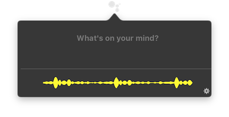
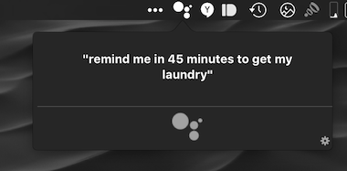
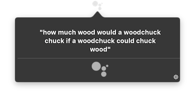

# MacAssistant

   

***NOTE: I've currently hit the API limit and am working with Google to resolve this and give me more API quota.***
*You can also obtain your own OAuth client key and build the project yourself by following the Build Instructions below.*

A project that integrates the Google Assistant into macOS, using the Google Assistant SDK.

*"Google Assistant is now on over 100 million devices" - Sundar Pichai*

MacAssistant can bring that number to 200 million

## Download
Downloads are listed under the `Releases` tab.
Click [here](https://github.com/vanshg/MacAssistant/releases/download/0.2/MacAssistant.zip) to directly download the latest version.

MacAssistant is currently in Beta.

## Example Queries
*"What's the weather today?"*

*"My agenda for tomorrow."*

*"When was Benedict Cumberbatch born?*"

*"Does the president of the United States have any children?"*

## Build Instructions
MacAssistant is built using Swift 3.1 and Xcode 8

Dependencies are managed using Carthage. After you clone the project, run `carthage update --platform macOS`. (If you don't have Carthage, refer [here](https://github.com/Carthage/Carthage) for installation instructions)

You'll need OAuth credentials from the [Google Developer Console](https://console.developers.google.com). In order to get them, you'll need to create a new project and enable the Assistant API for that project. Then, generate an OAuth credential, and select application type of `Other`. Download the json file by clicking the button on the right. Finally, rename the file to `google_oauth.json` and place it in your project (*/MacAssistant/google_oauth.json*).

## Contributing
Please feel free to contribute to this project. I welcome all contributions and pull requests. There is a list of pending things that need to be worked on in the `TODO.md` file.

## License
This project is licensed under the MIT License - see the [LICENSE](LICENSE) file for details
